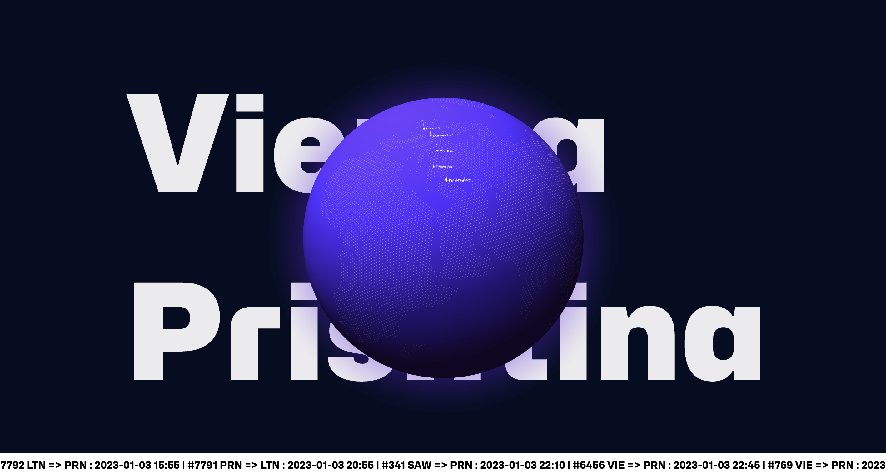
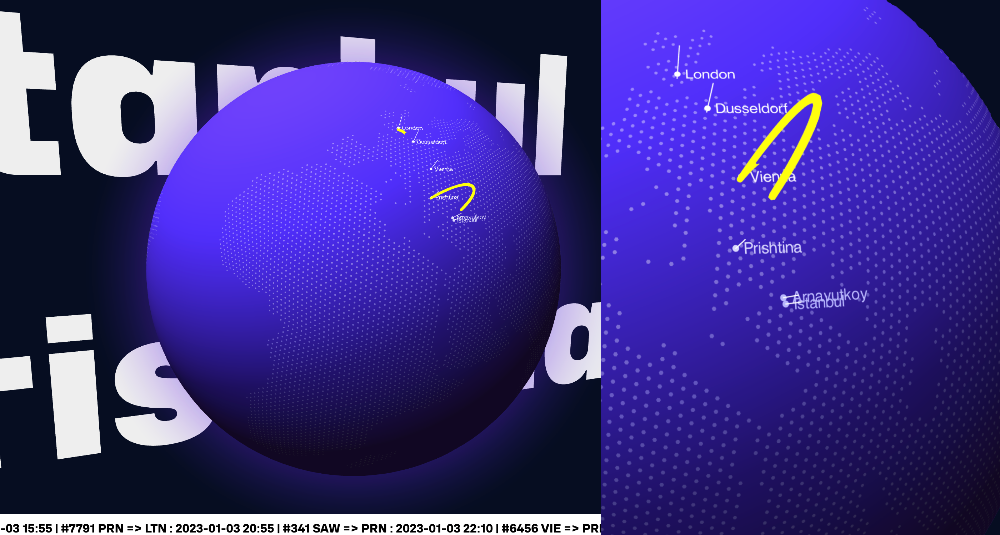

import { Tweet } from "react-twitter-widgets"
import { Link } from "gatsby"

 

Welcome to **"Prishtina International Airport: Visualized"!** This exciting project combines the power of the **Three.js** library with real-time data from Flight APIs and stores it in **Firebase** to create a dynamic, **interactive globe**. 

The focuses on visualizing all plane flights that have Prishtina International Airport "Adem Jashari" as a point of arrival or departure.

Special thanks to the tutorial from [Epic Programmer](https://www.youtube.com/watch?v=ddIZlWmfFKM) for helping me learn how to use the "Three Globe" library.

 

 

#### Technologies Used:

* **Three.js library:** a powerful tool for creating 3D graphics and visualizations on the web
* **APIs:** used to retrieve data on flights arriving and departing from Prishtina International Airport, including the "https://airlabs.co/" API

* **Firebase:** used as a cache for data in order to improve the performance and speed of the app

* **OrbitControls module:** allows users to navigate and interact with the globe

* **FontLoader module:** used to add 3D text for arriving and departuring locations behind the globe

 

 

 

#### APIs and Data Sources

In order to display accurate and up-to-date flight information, we use a third party API to retrieve data on flights arriving at or departing from Prishtina International Airport. One of the APIs used is "https://airlabs.co/". The project also uses Firebase as a cache for this data in order to improve the performance and speed of the app.

 

#### Three.js Library

The Three.js library is a powerful tool for creating 3D graphics and visualizations on the web. We used the "three-globe" library project to render the globe and add various types of lights and fog to the scene.

 

#### OrbitControls and FontLoader Modules

The OrbitControls module allows users to navigate and interact with the globe, while the FontLoader module is used to add text labels to different locations on the globe.

 

#### Real-Time Data from Firebase

The real-time data from Firebase is used to power some of the more dynamic features of the globe, including displaying real-time information about different countries and airports on the globe.

#### Conclusion

Overall, this project is a great example of how modern web technologies can be used to create interactive and engaging visualizations. Whether you're interested in geography, data visualization, or just want to have some fun, "Three Globe" is sure to be a project that you'll enjoy exploring.